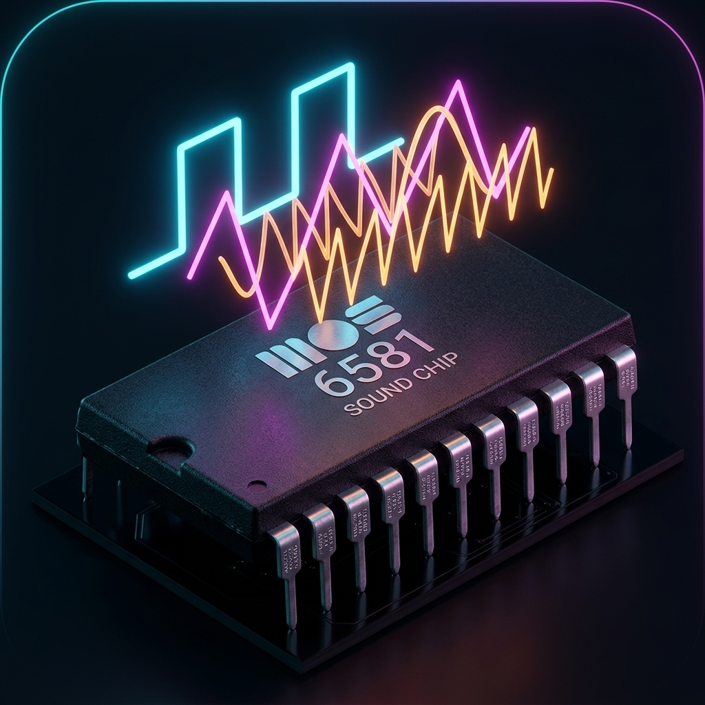
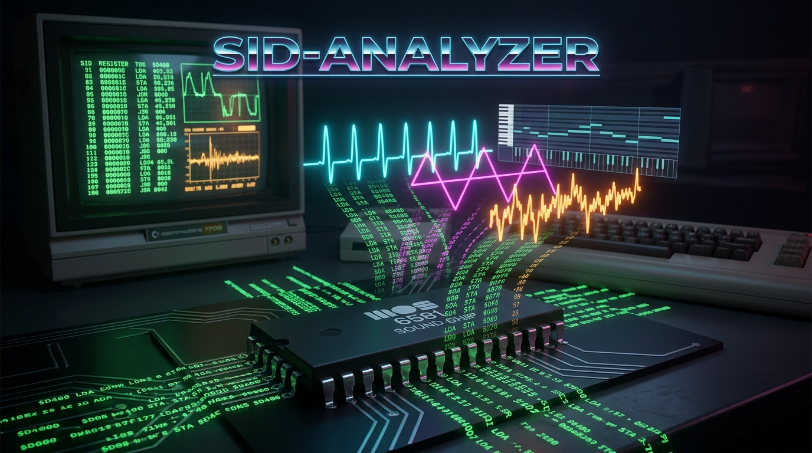

#  sid-analyzer

<p align="center">
  
</p>

A Rust tool that extracts musical structure from Commodore 64 SID files.

**Experimental, pre-release software.** APIs, JSON schemas, and project exports
may change without backward compatibility. Musical analysis is inferred from
player execution; MIDI and synth exports are approximations of the source.

[Quick start](#install) · [Usage](#usage) · [Limitations](#known-limitations) ·
[Development roadmap](plans/PLAN.md)

> **Note:** SID tunes are 6502 programs that drive the SID chip in real time,
> so their musical structure must be reconstructed by executing the player.
> `sid-analyzer` turns that execution into machine-readable analysis, a
> replayable bus capture, expressive MIDI, and editable Pertylizer projects.
> These artifacts support AI-assisted analysis as well as conventional
> reverse-engineering and music-tool workflows.

## What it does

1. Parses the **PSID v1-v4 and RSID v2-v4 header** (title, author, init/play
   addresses, clock domain, SID model, speed bitmask, secondary SID
   addresses, …).
2. Loads the music into a built-in **6502 emulator** (on top of the
   `mos6502` crate) and runs `init` followed by N play frames.
3. Captures ordered reads and writes in the **SID register window
   `$D400-$D41C`**, including call/cycle timing, checkpoints, diagnostics, and
   configured secondary SID chips.
4. Reconstructs **physical and digital chip state**: voice frequencies, ADSR
   envelopes, oscillator phase/noise state, waveforms, pulse widths, gate /
   sync / ring-mod bits, filter cutoff / resonance / routing / mode, and
   master volume.
5. Converts SID oscillator frequencies to **MIDI notes** (with cent
   offsets) and detects note-on / note-off events from gate
   transitions.
6. Detects **musical effects** from composer-agnostic register-pattern
   heuristics: sync/ring modulation, `$D418` samples, PWM, filter modulation,
   portamento, vibrato, tremolo, arpeggios, and voice-3 modulation. Thresholds
   are tunable, and detune/octave/echo voice relations are reported separately.
7. Builds per-note **timbre characteristics**, reusable patches, and a
   target-neutral analyzed SID program; supported player families can also be
   decoded from their native song tables.
8. Exports tracker text, analysis/program/capture JSON, format-1 MIDI,
   reconstructed digi WAV files, or trace-derived/native/modern Pertylizer projects.

[Pertylizer](https://github.com/pertyjons/pertylizer) is a separate modular audio
workstation for opening, editing, and rendering the exported `.ptz` projects.
Creating a project requires no running Pertylizer instance or MCP connection.
The analyzer itself has no playback UI or full SID-to-WAV renderer.

## Install

Rust 1.98 is required. The repository's `rust-toolchain.toml` selects it
automatically when using rustup. A native C/C++ build toolchain is also needed
for the optional bundled SQLite dependency.

Clone the repository and install the main CLI from source:

```sh
git clone https://github.com/pertyjons/sid-analyzer.git
cd sid-analyzer
cargo install --path crates/analyzer --bin sid-analyzer --locked
sid-analyzer --help
```

Cargo installs the executable in its bin directory (usually `~/.cargo/bin`);
that directory must be on your `PATH`. To build all development tools locally:

```sh
cargo build --release --workspace --locked
./target/release/sid-analyzer --help
```

`cargo build` leaves executables under `target/release/`; it does not install
them on `PATH`. The usage examples below assume the main CLI is installed.

The SQLite-backed corpus scanner is optional:

```sh
cargo build --release --workspace --features corpus-scan --locked
```

Primary binaries include:

- `target/release/sid-analyzer` — single-file analyzer and export CLI.
- `target/release/sid-corpus-scan` — optional bulk scanner that writes per-file
  and per-subtune statistics to SQLite for offline querying.
- `target/release/sid-composer-census` — deterministic composer catalog or
  driver-family census with ranked extraction and representation gaps.
- `target/release/sid-re` — disassembly, memory inspection, corpus signatures,
  clustering, taint tracking, differential probes, and WAV band analysis.

## Usage

Use a SID file you have permission to use; third-party tunes are not included in
the current source tree. `--frames 3000` means 3,000 scheduled play calls,
roughly one minute at PAL vblank speed. CIA-timed players can run at other rates.

```sh
# Print SID header metadata only
sid-analyzer foo.sid

# Run 3000 play frames, dump raw register writes
sid-analyzer foo.sid --frames 3000 --trace

# siddump-style tracker view
sid-analyzer foo.sid --frames 3000 --format text

# JSON analysis
sid-analyzer foo.sid --frames 3000 --format json --pretty --output foo.json

# Lossless, cycle-ordered SID-bus capture JSON
sid-analyzer foo.sid --frames 3000 --format capture-json --output foo.capture.json

# MIDI export with pitch, volume, cutoff, and resonance expression
sid-analyzer foo.sid --frames 3000 --format midi --output foo.mid

# Reconstruct dense $D418 volume-register PCM streams as WAV files
sid-analyzer foo.sid --frames 3000 --format digi-wav --output digi/

# Export an editable Pertylizer project from the trace
sid-analyzer foo.sid --frames 3000 --format synth --enhance 5 --output foo.ptz

# Strict driver-native or modern-analog export
sid-analyzer foo.sid --frames 3000 --format synth-native --output foo-native.ptz
sid-analyzer foo.sid --frames 3000 --format synth-modern --output foo-modern.ptz

# Analyze the full subtune using your HVSC duration database
sid-analyzer foo.sid --songlengths /path/to/Songlengths.md5 --format json --output full.json

# Override the clock domain
sid-analyzer foo.sid --frames 3000 --clock ntsc --format json
```

Full flag reference: `sid-analyzer --help`.

Omitting `--frames` in export mode uses the selected subtune's Songlengths
duration, if found. Without a matching duration, supply `--frames`. Diagnostic
flags such as `--trace` and `--effects` also need a positive `--frames` value to
run the player.

### Flags at a glance

| Flag              | Purpose                                                    |
|-------------------|------------------------------------------------------------|
| (none)            | Print SID header metadata only.                            |
| `--subtune N`     | Subtune to run (1-based). Default: header `start_song`.    |
| `--frames N`      | Play calls to emulate; exports default to Songlengths.      |
| `--clock <C>`     | `auto` (default), `pal`, or `ntsc`.                        |
| `--trace`         | Diagnostic: raw per-frame register-write dump.             |
| `--effects`       | Diagnostic: detected effect spans.                         |
| `--format <F>`    | `text`, `json`, `program-json`, `capture-json`, `midi`, `digi-wav`, `synth`, `synth-native`, or `synth-modern`. |
| `--enhance <1-10>` | Add role-aware production effects to `synth` or `synth-native`; 5 is balanced and 6–10 are progressively heavier. |
| `--output PATH`   | Destination; required for MIDI, digi WAV, and all synth formats. |
| `--digi-sample-rate HZ` | WAV rate for `digi-wav` (default: 44100).            |
| `--pretty`        | Indent JSON output.                                        |
| `--allow-rsid`    | Permit explicitly unreliable RSID emulation diagnostics.   |
| `--songlengths PATH` | Optional local `Songlengths.md5` (or `HVSC_SONGLENGTHS`). |
| `--stil PATH`     | HVSC STIL metadata database (or `HVSC_STIL`).               |

`text`, `json`, `program-json`, and `capture-json` default to stdout. `midi`,
`digi-wav`, `synth`, `synth-native`, and `synth-modern` require `--output`. In
`--format` mode all other human-readable stdout output is suppressed, leaving
one clean artifact.

Synth exports also write a `.census.json` sidecar with validation, selected
representations, and fidelity limitations. Native extraction supports specific
Hubbard, Crowther, Galway, Gremlin, Whittaker, and GoatTracker variants; a
recognized composer or driver name alone does not guarantee export support.
See the [export reference](docs/export.md) and [driver notes](docs/drivers/).

## JSON shape

This abbreviated excerpt shows the current field names; full output also
contains complete header fields, patch/timbre data, duration metadata, and
optional STIL, digi, and additional-SID sections.

```json
{
  "header": {
    "format": "Psid",
    "name": "Nemesis the Warlock",
    "author": "Rob Hubbard",
    "songs": 15,
    "start_song": 1,
    "flags": { "clock": "Pal", "sid_model": "Mos6581" }
  },
  "subtune": 1,
  "timing": {
    "clock": "PAL",
    "call_rate": { "numerator": 985248, "denominator": 19656 },
    "cia_timed": false
  },
  "frame_count": 300,
  "notes": [
    {
      "voice": 2,
      "start_frame": 2,
      "end_frame": 127,
      "midi": 83,
      "cents": 0.4009737,
      "program": 73,
      "velocity": 111,
      "patch_id": 0
    }
  ],
  "effects": [
    { "effect": "RingMod", "voice": 2, "start_frame": 2, "end_frame": 3 }
  ],
  "voice_relations": []
}
```

Effect variants include `HardSync`, `RingMod`, `Sample`, `PWM`,
`FilterSweep`, `FilterResonanceSweep`, `FilterModeModulation`, `Portamento`,
`Vibrato`, `Tremolo`, `Arpeggio`, and `Voice3Modulator`. JSON also carries
cross-voice detune/octave/echo relations, `$D418` PCM summaries, configured
secondary-SID analyses, Songlengths durations, and optional STIL metadata.

`program-json` is a debug serialization of the target-neutral analyzed SID
program. `capture-json` is the canonical lossless interchange form: it
preserves every ordered SID read/write with chip identity, call and cycle
timing, digital SID checkpoints, oscillator/envelope observations, timing
diagnostics, and source identity. Its `schema_version` is independent of the
higher-level analysis JSON shape.

MIDI declares a ±12-semitone pitch-bend range and derives bend automation from
the physical frequency timeline, covering vibrato, portamento, and arpeggios.
CC11 follows the digital envelope and SID master volume; CC74 and CC71 carry
filter cutoff and resonance while a voice is routed through the SID filter.

## Corpus scanning

`sid-corpus-scan` runs the same analysis pipeline across a whole directory
tree of SID files and stores per-file and per-subtune aggregates in SQLite.
Intended for calibrating effect-detection thresholds against the full HVSC
corpus and producing fixtures for downstream timbre work. Build it with the
`corpus-scan` feature as shown under [Install](#install).

```sh
./target/release/sid-corpus-scan --root /path/to/HVSC --db hvsc.sqlite --workers 8
```

- Walks `--root` recursively for `.sid` files (case-insensitive).
- Runs in parallel via rayon; a single writer thread batches inserts in
  transactions.
- RSID and MUS/STR files are recorded using `skip_kind` and `skip_detail` and
  are not silently emulated.
- Emulator panics and instruction-guard trips are captured per subtune in
  the `emu_error` column instead of aborting the scan.
- **Resumable**: re-running with the same `--db` skips files whose MD5 is
  already present. Pass `--no-resume` to force re-analysis.
- `--subtunes start` (default) scans only the file's `start_song`;
  `--subtunes all` scans every subtune.

### Schema

| Table           | Contents                                                                                       |
|-----------------|------------------------------------------------------------------------------------------------|
| `files`         | Path, MD5, size, full header metadata, typed skip kind/detail, error, scan timestamp           |
| `subtunes`      | One row per analysed subtune: frames, CIA-timed flag, note counts, min/max MIDI, gate frames   |
| `effect_counts` | Aggregated effect spans per `(subtune, effect, voice)`: span count + total frames active       |
| `meta`          | Scanner version, scan parameters, last-scan root                                               |

### Example queries

```sql
-- Effect prevalence across the corpus
SELECT effect, SUM(span_count) AS spans, SUM(total_frames) AS frames
FROM effect_counts GROUP BY effect ORDER BY spans DESC;

-- Top vibrato users (calibration sanity check)
SELECT f.author, f.title, SUM(e.span_count) AS vibratos
FROM effect_counts e
JOIN subtunes s ON s.id = e.subtune_id
JOIN files    f ON f.id = s.file_id
WHERE e.effect = 'Vibrato'
GROUP BY f.id ORDER BY vibratos DESC LIMIT 20;

-- Files the emulator could not run
SELECT f.path, s.subtune, s.emu_error
FROM subtunes s JOIN files f ON f.id = s.file_id
WHERE s.emu_error IS NOT NULL;
```

### Composer census

`sid-composer-census` measures musical traits, native extraction coverage, and
representation priorities across an explicit artist directory. An optional
`--driver-filter` instead selects one SIDId family from a larger tree.

```sh
./target/release/sid-composer-census \
  --corpus /path/to/C64Music/MUSICIANS/H/Hubbard_Rob \
  --subject "Rob Hubbard" \
  --full-length \
  --songlengths /path/to/C64Music/DOCUMENTS/Songlengths.md5 \
  --subtunes all \
  --workers 8 \
  --output hubbard-census.json \
  --summary-output hubbard-census-summary.json \
  --markdown-output hubbard-census.md
```

Full-length mode traces every PSID subtune for its HVSC duration while native
validation remains capped by `--native-frames` (1,500 by default). Missing
durations use the explicit `--frames` fallback and are counted separately.
Pass `--driver-filter Rob_Hubbard` with a whole HVSC root to measure the driver
family instead of the artist catalog.

See the HVSC #84 [Rob Hubbard census](docs/hubbard-corpus-census.md) and
[Martin Galway census](docs/galway-corpus-census.md) for measured baselines,
cross-composer interpretation, and fixture priorities.

## Architecture

```
crates/analyzer/src/
  header.rs              PSID/RSID header parser and domain newtypes
  emu/
    bus.rs               RAM, SID windows, bus latch, read/write capture
    capture.rs           replayable ordered capture and checkpoints
    runner.rs            6502 subroutine driver (mos6502 adapter)
    sid.rs               digital envelope, oscillator, sync/ring, TEST/noise
    mod.rs               load → init → scheduled play-call loop
  trace.rs               calls, register events, reads, timing diagnostics
  analysis/
    voice.rs             physical SID voice state
    note.rs              notes, pitch, velocity, program mapping
    effects.rs           12 effect kinds + voice relations
    timbre/              per-note characteristics and patch clustering
    sid_program/         target-neutral causal program and validation
  export/
    text.rs              tracker-style table
    json.rs              self-describing analysis JSON
    midi.rs              expressive format-1 SMF
    native/              strict driver-native extraction
    synth.rs             Pertylizer lowering and fidelity census
    forward.rs           forward-model verification gate
  audio.rs               WAV parsing, profiles, and A/B comparison
  playerid.rs            embedded SIDId signature matcher
  songlengths.rs         HVSC duration lookup
  stil.rs                optional HVSC STIL lookup
  bin/
    main.rs              main sid-analyzer CLI
    sid-corpus-scan.rs   bulk SQLite scanner
    sid-composer-census.rs composer/driver-family census
    sid-re.rs            reverse-engineering toolkit
```

Domain values are wrapped in newtypes (`SidFreq`, `MidiNote`, `Cents`,
`FrameIndex`, `VoiceId`, `Cutoff`, `Resonance`, …) so the SID chip's
overlapping bit-packed fields (12-bit pulse width vs 11-bit cutoff vs
16-bit frequency vs 4-bit ADSR nibbles, …) cannot be silently
confused.

See `plans/PLAN.md` for the full design rationale.

## Known limitations

- **RSID** support requires Kernal/BASIC ROM stubs and a fuller C64
  environment. Header inspection works, but emulation/export is refused unless
  the explicitly unreliable `--allow-rsid` override is supplied.
- **CIA host behavior**: an init-programmed timer period drives exact playback
  timing, but players that install IRQ handlers, omit the initial period, or
  reprogram the timer during playback remain outside the exact host model.
- **Secondary SID chips** have bus capture and musical analysis, but digital
  checkpoint/replay state is currently primary-chip only. Text, MIDI, digi WAV,
  and synth output represent only the primary SID; use `json`, `program-json`,
  or `capture-json` for additional chips.
- **MUS/STR payloads** are identified but cannot be emulated or exported.
- **Digi WAV export** reconstructs detected cycle-stamped 4-bit PCM streams as
  separate WAV artifacts; it is not a full mixed render of SID voices plus digi.
- **Native synth export** is intentionally strict and rejects unknown driver
  families, unsupported variants, inexact timing, or failed validation instead
  of silently falling back to trace-derived output.
- **MIDI timing** uses one tick per scheduled play call. Pitch bend and
  expression/filter controllers follow the frame timeline, but sub-frame SID
  bus timing is not representable in the MIDI export.
- **Effect thresholds** ship with permissive defaults — calibration
  against a broader HVSC corpus is ongoing (`sid-corpus-scan` exists
  specifically to drive this).

## Build / test / lint

```sh
cargo fmt --check
cargo build --workspace
cargo clippy --workspace --all-targets
cargo test --workspace
```

All four must pass with zero warnings or errors before a commit lands
(see `AGENTS.md`).

The [CI workflow](.github/workflows/ci.yml) runs this gate both with default
features and with `corpus-scan`. Tests use synthetic fixtures and committed
oracle data; they do not require a music collection, a running Pertylizer,
or the external oracle generator. A separate mandatory CI job validates
synthetic PTZ exports against the full project schema with Python `jsonschema`.
See [CONTRIBUTING.md](CONTRIBUTING.md) for its local setup and command.

## Optional local music corpus

Third-party SID files are not distributed with this repository. Place licensed
local fixtures under the ignored `assets/music/` directory and run the extended
asset-backed suite explicitly:

```sh
cargo test --workspace --features asset-tests
```

The default test gate is self-contained and uses synthetic fixtures.

## HVSC Songlengths

Download [Songlengths.md5 directly from HVSC](https://www.hvsc.c64.org/download/C64Music/DOCUMENTS/Songlengths.md5).
It is also included at `C64Music/DOCUMENTS/Songlengths.md5` in the full
collection available from the [HVSC download page](https://www.hvsc.c64.org/downloads).
Save the file locally and pass its path to the analyzer:

```sh
sid-analyzer foo.sid --songlengths /path/to/Songlengths.md5 --format json --output foo.json
```

Alternatively, set `HVSC_SONGLENGTHS` to the file's path. Use the modern
`Songlengths.md5` file; the legacy `Songlengths.txt` hash format is not supported.

No Songlengths database is distributed, embedded, downloaded automatically, or
loaded implicitly. You may keep your copy at the ignored
`assets/Songlengths.md5` path and select it with
`--songlengths assets/Songlengths.md5` or `HVSC_SONGLENGTHS`.

The database maps a plain MD5 of the entire SID file to per-subtune durations.
Without a database or a matching entry, supply `--frames` for exports;
header-only inspection works without one. The composer census requires an
explicit database for `--full-length`, while the corpus baseline uses
`--fallback-secs` when no duration is available. Both tools also accept
`HVSC_SONGLENGTHS`.

HVSC STIL metadata is optional because no STIL snapshot is bundled. Pass
`--stil /path/to/C64Music/DOCUMENTS/STIL.txt` or set `HVSC_STIL`. Matches use
the canonical HVSC path when available and otherwise require a unique filename;
global and selected-subtune fields are printed in the header view, while JSON
retains the complete structured entry.

## Licensing and attribution

Copyright (C) 2026 Per Jonsson.

sid-analyzer is free software: you can redistribute it and/or modify it under
the terms of the GNU General Public License as published by the Free Software
Foundation, either version 3 of the License, or (at your option) any later
version (`GPL-3.0-or-later`).

It is distributed in the hope that it will be useful, but WITHOUT ANY WARRANTY;
without even the implied warranty of MERCHANTABILITY or FITNESS FOR A
PARTICULAR PURPOSE. See [LICENSE](LICENSE) for the full terms.

Unless otherwise noted, this license covers the project's own source code and
documentation. Third-party material retains its stated licenses and attribution;
see [THIRD_PARTY_NOTICES.md](THIRD_PARTY_NOTICES.md).

Using the analyzer does not by itself place exported JSON, MIDI, WAV, or
Pertylizer projects under GPL. Rights in the input music still apply. The
current PTZ scripts were [reviewed](docs/resid-licensing.md#exported-projects-and-data);
no special output exception is included.

Songlengths and third-party music are supplied locally by the user and are not
covered by the project license.
